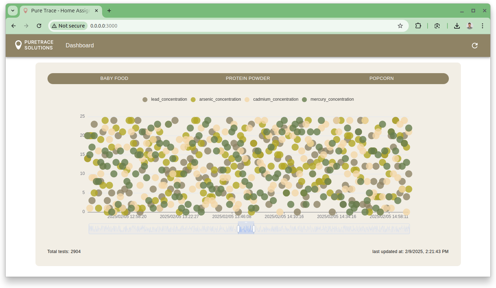
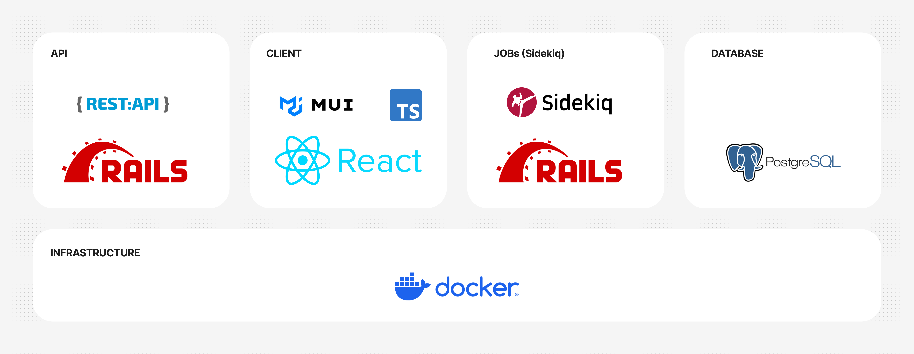

# PureTrace

## Introduction

PureTrace is a fictional company that provides a food testing and compliance solution for consumer packaged goods (CPG) brands. In this fictional model, the company operates a laboratory in the United States where brands send product samples for testing to detect heavy metals and other contaminants, ensuring compliance with food safety regulations. Test results are stored in a database, and PureTrace provides visualization tools to help customers better understand their data.



Read the [REQUIREMENTS.md](REQUIREMENTS.md) before starting and the [SYSTEM-DESIGN.md](SYSTEM-DESIGN.md) to learn more about the architecture used.

## Infrastructure

This web application architecture consists of a Ruby on Rails backend serving a REST API, a React frontend with TypeScript and MUI for UI components, and PostgreSQL as the database. Background job processing is handled by Sidekiq, integrated with Rails. The entire system is containerized using Docker, ensuring a consistent and portable development and deployment environment. This setup provides a scalable and maintainable solution with a clear separation of concerns between the API, client, database, and background jobs.



## Running the Project

### Getting Started

Copy the environment variables from `.env.example` to `.env` inside the Docker folders to run the project.

### Running the Project

To run the database, you need to have Docker installed on your machine. If you don't have it installed, you can download it [here](https://www.docker.com/products/docker-desktop).

### Database

To start the database, run the following command:

```bash
docker-compose up -d postgres
```

### API and Sidekiq

To run the project, use the following command with Docker Compose:

```bash
docker-compose up -d server sidekiq
```

Alternatively, you can run the project without Docker Compose using:

```bash
bundle exec puma -C config/puma.rb && bundle exec sidekiq -C config/sidekiq.yml
```

### Seeding the Database

```bash
docker compose run server bundle exec rails db:seed
```

## Client

To run the client, use the following command:

```bash
docker compose up client
```

Alternatively, you can run the client without Docker Compose using:


```bash
cd client && yarn start
```

## Tests (RSpec)

The project uses RSpec for testing, to understand the tests, check the [`spec`](/server/spec/requests) folder.

Prepare the test database:

```bash
RAILS_ENV=test bin/rails db:create db:migrate db:seed
```

To run the tests, use the following command:

```bash
RAILS_ENV=test bundle exec rspec
```

## License

This project is licensed under the MIT License - see the [LICENSE](LICENSE.md) file for details.
